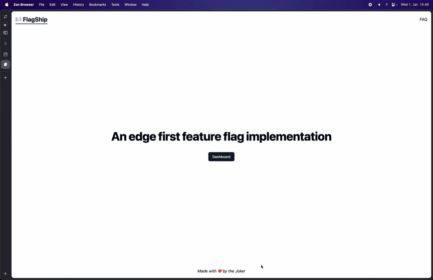
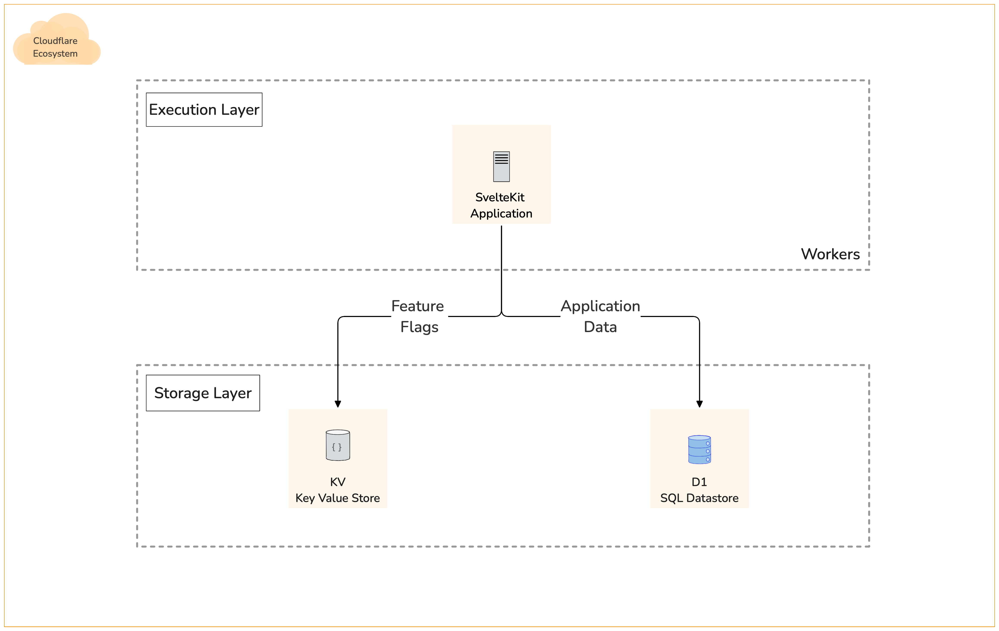
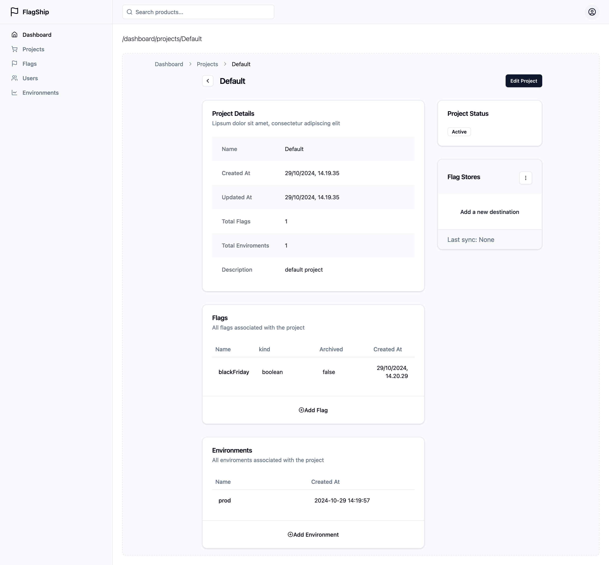
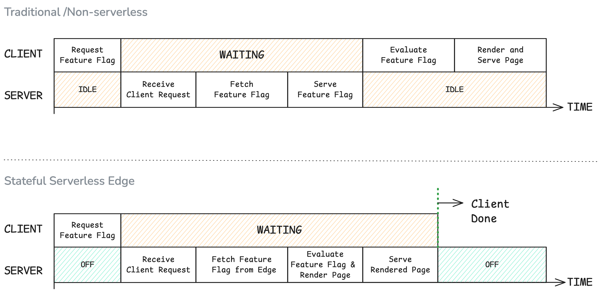

# FlagShip

An edge-first Feature Flag Management application [WIP].

A Scalable Feature Flag service you run yourself on Cloudflare.



## Architecture

FlagShip is fully serverless and is hosted on cloudflare workers platform. It uses D1 for storing application data and syncs flags specific to each project to a configurable destination.

At the moment, only Cloudflare KV is supported as the sync destination.



## Pre-Requisites:

- Working cloudflare account
- Setup D1 and KV on cloudflare account, Either through CLI or through dashboard
- Setup Cloudflare Zero trust access for the application domain (this is to delegate the auth functionality to cloudflare)
- Setup the following env variables in a `.env` file in the root of the project:

```bash

CLOUDFLARE_POLICY_AUD="6504a7a77b829804b0b8ac8538bb57874ac361ffc27d5ef37f069e4b3d39869b"
CLOUDFLARE_TEAM_DOMAIN="https://example.cloudflareaccess.com"
PUBLIC_CLOUDFLARE_TEAM_DOMAIN="example.cloudflareaccess.com"
CLOUDFLARE_D1_TOKEN="UomOTLEvczkP6fcC17C9LJajXB_xD9VrhfbrnXab"
CLOUDFLARE_D1_ID="0e0abed4-b08b-4298-8e13-85d127c2f799"
CLOUDFLARE_ACCOUNT_ID="1cab5655572c1f2e586fd8261228c4c0"
CLOUDFLARE_KV_API_TOKEN="CxbfPWE5tUa48UoE3DVAN_Oz7Lv8pwwuh9Lkiwmo"
CLOUDFLARE_KV_NAMESPACE_ID="5c21b61cab2740e480cde15f62984056"

```

All of the above variables can be found on the cloudflare workers dashboard.

## Developing

Once you've created a project and installed dependencies with `npm install` (or `pnpm install` or `yarn` or `bun`), start a development server:

```bash
npm run dev

# or start the server and open the app in a new browser tab
npm run dev -- --open
```

## Building

To create a production version of your app:

```bash
npm run build
```

You can preview the production build with `npm run preview`.

## Notes

<details><summary>Application Screenshot</summary>



</details>

### Motivation

This project was created as part my Master's Thesis. The initial idea was to evaluate the feasibility of running a stateful workload on the edge using commertially available tools and services and compare it againt traditional non serverless (and non edge based) workloads.

I also did notice that Cloudflare doesn't have an offering for Feature Flag management as part of its product suite.

On further digging, I found some more interesting advantages of running a Feature flag service at the edge. Apart from the obvious advantage of reduced latency, it can also be combined with server-side rendering to provide a more efficient and faster experience to the end user.



### Stack Used

- [SvelteKit](https://svelte.dev/docs/kit/introduction)
- [Cloudflare Workers](https://workers.cloudflare.com/)
- [Cloudflare KV](https://developers.cloudflare.com/kv/)
- [Cloudflare D1](https://developers.cloudflare.com/d1/)
- [Cloudflare ZTNA](https://www.cloudflare.com/zero-trust/products/access/)
- [Drizzle](https://developers.cloudflare.com/d1/)
- [shadcn-svelte](https://next.shadcn-svelte.com/)
